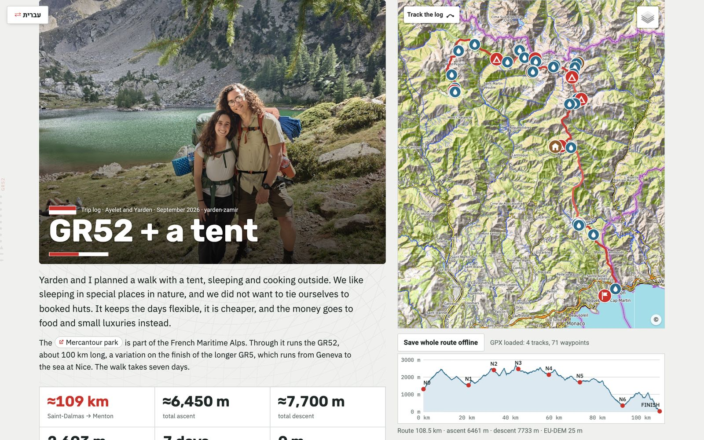
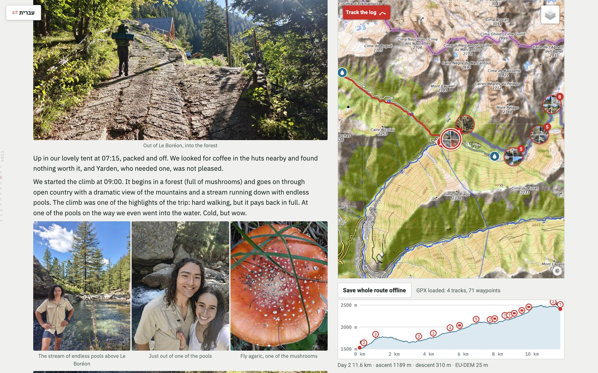
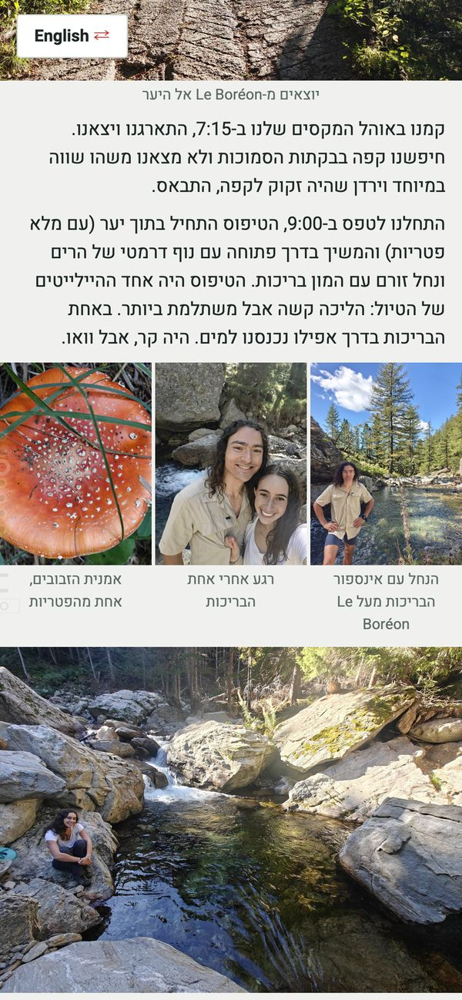
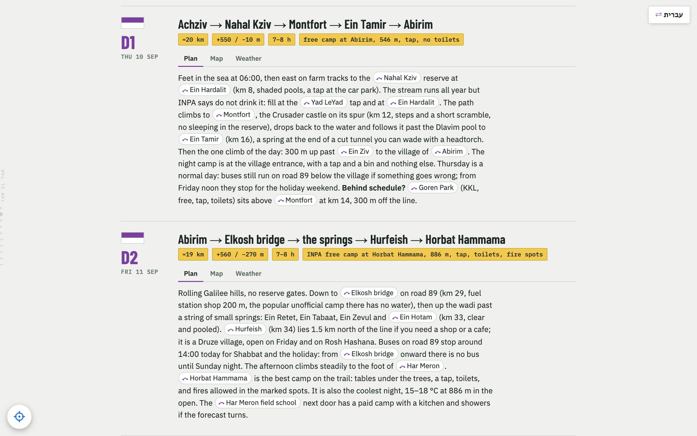

# Trek site template

A static site for a multi-day hike, before and after the walk. Before: a day-by-day plan with a live map from the real GPX, weather per day, a day simulator and an offline mode for the trail. After: the trip as a story, with pictures and videos on the map, a map that follows the reader, and editing on the page for the people who walked it. Both work in two languages, right-to-left included. The site deploys to a VPS with [KitSHn](https://github.com/Yarden-zamir/kitshn).

Sites built from it:

- [gr52.yarden-zamir.com](https://gr52.yarden-zamir.com): the GR52 across the Mercantour, 7 days with a tent. The trip log is the front page; the plan is at [/plan/](https://gr52.yarden-zamir.com/plan/). Repo: [Yarden-zamir/gr52](https://github.com/Yarden-zamir/gr52).
- [yam2yam.yarden-zamir.com](https://yam2yam.yarden-zamir.com): the Israel Sea to Sea trail, 4 days with a tent, in the heat. A plan. Repo: [Yarden-zamir/yam2yam](https://github.com/Yarden-zamir/yam2yam).



| A day of the story, the map tracking the pictures | The same day on a phone, in Hebrew |
| --- | --- |
|  |  |



## What it does

### The plan

- **Day cards** with Plan, Map and Weather tabs. The Map tab shows that day's stretch, fitted, with its elevation profile and stats.
- **The map** draws the GPX tracks and waypoints, with a layer per kind and per day. It rotates with two fingers, and it zooms with a pinch or Ctrl and the wheel. Place names in the text are chips that open the map at that place, and a "Back to …" bubble returns the reader.
- **Weather** for each day, at the night spot and the day's high point, from Open-Meteo. The page computes the warnings: storm, rain, snow, wind, frost, heat, fog, UV and a late arrival. Each warning links to its numbers.
- **The day simulator**: a start-time slider shows where you are through the day, the weather there, an ensemble storm strip, and a recommended start.
- **The position snapshot**: one tap takes a position fix. The page draws you on the map and the profile, marks the earlier days done, and fills in today's distance, the climb left and an arrival time.
- **Offline**: a service worker keeps the page, the GPX and the app. "Save whole route offline" stores a corridor of map tiles, and the last forecast shows first on every load.
- **Downloads**: the GPX for any map app that reads it, and annotated section maps for printing.

### The trip log

- **The story as the front page** (`"story"` in `trek.json`). The plan moves to `/plan/`, with a note that it is the plan as it was.
- **A cover picture** with parallax. It is also the link preview picture that WhatsApp and the like show.
- **Days with Log, Pictures, Map, Weather and Tips tabs**, plus reference sections such as "Before you go" and "Links".
- **Pictures and videos** go on the map by their GPS position, or by the time of day when a picture has no position. Pictures on one line of the text sit side by side and fill the row at one height. On a phone they reach both edges of the screen. The lightbox fills the screen and zooms, and videos play in it.
- **The map beside the story**, on a wide screen or a phone on its side, at the full height of the window. It follows the day being read. "Track the log" flies it to each picture as the reader scrolls.
- **Reading aids**: a dot rail for the days, a light buzz for each day and each picture on Android, and a glide onto the next day after the finger lifts.
- **Editing on the page**, for the GitHub logins in `"editors"`. The pencil or a long press opens the editor at that spot. Pictures show in the editor. A selection shows the markdown tokens of the pictures in it. Undo and redo work, and the toolbar stays in view. A long press on a picture sets its caption, its place on the map or the cover, or hides it.
- **Uploads on the page**: pictures, videos, or a Google Photos zip, read in the browser. The time and place come from the file or its sidecar.
- **A TV**: Google Cast from the foot of the page, and a remote's arrow keys walk the story.

## How it works

The site is static. A build turns data files into HTML, and three containers serve it:

```text
trek.json + content.yaml + log/<user>/log.yaml
        │  src/build.py
        ▼
site/ (HTML per language, service worker, manifest)   Caddyfile.j2   compose.override.yml
        │  git push → KitSHn (GitHub Actions → VPS)
        ▼
┌────────────── the VPS ──────────────────────────────────────────────┐
│ host Caddy ─unix socket→ site (Caddy)                               │
│                            ├─ static files                          │
│                            ├─ /auth/* ─────────→ oauth2-proxy (GitHub) │
│                            └─ uploads, edits ──→ uploader (Python)  │
│                                                   pictures, videos, │
│                                                   edits.json        │
└─────────────────────────────────────────────────────────────────────┘
```

- **`src/build.py`** reads `trek.json`, `content.yaml` (the plan) and `log/<user>/log.yaml` (the trip log). It writes the pages for each language into `site/`, the service worker, the manifest, `Caddyfile.j2`, and `compose.override.yml`. The override file holds the editors, the time zone and, when `"auth": true`, the oauth2-proxy service.
- **The page** is plain JavaScript without a framework: `site/map.js` (the map, the profile, the rail and navigation), `site/log.js` (pictures, the lightbox, the editor, weather, casting) and `site/trip.js` (the plan's weather, simulator and snapshot). Leaflet and leaflet-rotate are in `site/vendor/`.
- **`uploader/`** is a small Python service with Pillow and ffmpeg. It resizes pictures, remakes videos for the web, makes link preview crops, and keeps the page edits in `edits.json` on a volume. The page lays those edits over the built HTML on load. `tools/log_pull.py` folds them back into `log.yaml`.
- **Sign-in** is oauth2-proxy with a GitHub App. Anyone can sign in. Only the logins in `"editors"` can edit, which the uploader checks.

## Start a new trek

1. Scaffold a repo: `uv run tools/new.py --slug … --name … --hostname … --start YYYY-MM-DD --days N`.
2. Find the route: `uv run tools/find_route.py --bbox …` gives the OpenStreetMap relations; put them in `trek.json`.
3. Research and build: `uv run tools/all.py` runs doctor, the GPX, the heights, the maps, the build and the checks.
4. Write the days in `content.yaml` and run `uv run src/build.py`.
5. Deploy with KitSHn: set it up once with `kitshn recipe auth`, then push `main`.
6. After the walk: write `log/<github-user>/log.yaml`, set `"story"`, and upload the pictures on the page.

The `trek-dossier` agent skill in `skills/trek-dossier/SKILL.md` gives the full workflow. To use it, link it with `ln -s $(pwd)/skills/trek-dossier ~/.claude/skills/trek-dossier`.

## Configuration

### `trek.json`

`trek.example.json` shows each key with a value.

| Key | What it sets |
| --- | --- |
| `slug`, `name`, `shortName`, `description`, `hostname` | The trek's identity and address. |
| `names`, `descriptions` | `{lang: text}`: the page title and the link preview per language. |
| `languages`, `defaultLanguage` | The languages, in order, and the one a first visit opens in. The first language owns the ids without a prefix. |
| `route`, `waypoints`, `gpx` | The route (OpenStreetMap relations in walking order), the waypoints, and the GPX file. |
| `timezone`, `plannedStart`, `tentWindow`, `treeline`, `heatLimit`, `exposed`, `weatherModel` | The settings the weather and the simulator use. |
| `places`, `sectionMaps` | Words in the text that become map chips, and the section maps. `tools/derive.py` fills both. |
| `accent`, `cover` | The trail colour, and the plan's cover picture when there is no trip log. |
| `story` | The GitHub login whose trip log is the front page. |
| `editors`, `auth` | The GitHub logins that can edit, and whether the sign-in service runs. |
| `castAppId` | A Google Cast receiver app, registered for `https://<hostname>/?cast=1`. |
| `repo` | The site's GitHub repo, for the link at the foot of the page. The default is the git remote. |
| `analytics` | A Google Analytics (GA4) measurement id, `G-…`. The tag reports only on the production hostname. `site/analytics.js` adds the page events: scroll depth, days and sections reached, pictures opened, map use and map links, tabs, language and downloads. `tools/analytics.py` reads the reports through a service account that is an Editor on the Analytics account; set `GA_SERVICE_ACCOUNT`, and `GA_GCLOUD_ACCOUNT` for the gcloud login that impersonates it. |

### `content.yaml`

The plan's text per language: the heading and the facts, one entry per day (`title`, `label`, `stats`, `hours`, `text`), then the rules, the huts table, the technical options, the practical lists and the links. Inline `<b>`, `<i>` and `<a>` are allowed.

### `log/<user>/log.yaml`

The trip log per language: `title`, `description`, `eyebrow`, `intro`, `facts`, the `days` (`text` and `tips`), `outro` and reference `sections`. Also `cover` (`{photo: ID, y: 45%}`), and `photos` (a caption, a day, a place or `hide` per picture id). The text takes these tokens:

- `[[photo:ID]]` places a picture. Pictures on one line sit side by side, and a line of its own starts a new row.
- `[[map:Name|label]]` opens the site's map.
- `[[gmaps:Place|label]]` opens Google Maps.
- `[[url:https://…|label]]` opens a site.
- Kinds joined with `;` make one chip that offers each.

`walked.json` lists how the walk differed from the plan: bypasses, out-and-back trips and moved nights. `tools/walked.py` rebuilds the GPX as walked, so the days, distances and picture places follow what happened.

## Commands

```sh
uv run tools/new.py --slug … --name … --hostname … --start YYYY-MM-DD --days N   # scaffold a trek repo
uv run tools/find_route.py --bbox … [--name …] [--pick id,id]   # find the OpenStreetMap relations
uv run tools/research.py      # OSM along the line → research/osm.md and proposed waypoints
uv run tools/dates.py         # holidays, Shabbat, sun, moon and clock changes on the dates
uv run tools/climate.py       # ten years of reanalysis on the dates, per night and pass
uv run tools/build_gpx.py     # route, waypoints, and water, huts and shelters from OSM → the GPX
uv run tools/elevation.py     # heights for every point (resumable)
uv run tools/derive.py        # places, section maps and defaults into trek.json
uv run tools/maps.py          # annotated section maps as WebP
uv run tools/doctor.py        # checks of the config, waypoints, content and GPX, with the fixes
uv run src/build.py           # the build: pages, service worker, manifest, Caddyfile.j2, compose.override.yml
uv run tools/check.py [--url https://host/]   # headless Chrome checks of the page
uv run tools/links.py [--no-net]   # every link and reference, and whether external pages answer
uv run tools/all.py [--from build] [--skip maps]   # doctor → GPX → heights → maps → build → doctor → check
uv run tools/walked.py        # after the walk: walked.json → the GPX as walked
uv run tools/log_pull.py      # fold the edits made on the live page into log/<user>/log.yaml
uv run tools/analytics.py setup|report|live   # Google Analytics: register the page events, print the reports
uv run tools/side_trips.py    # optional: side trips over OSM paths
uv run tools/import_body.py   # migration: a hand-written src/body.html → content.yaml
```

## Conventions the app relies on

Waypoint names carry meaning:

- `NIGHT n · <date> · <place>: <note>`. `NIGHT 0` is the night before day 1.
- `FINISH · …` marks the end of the walk.
- `PASS · <name> <ele> m - <note>`, with the type `Summit`.
- The day logic ignores `NIGHT n option B` and `FALLBACK`.

The types set the colours, icons and map layers: Night, Flag, Lodging, Campsite, Water, Summit, SideTrip, ViaFerrata, Escape, Transport, Shelter and Info. The tracks are `ROUTE i of N · …`, `BOUNDARY · …`, `SIDE TRIP · …` and `VIA FERRATA · …`.

## Deploy

The repo is a KitSHn recipe: `.kitshn.yaml`, `compose.yml`, `Dockerfile`, `container/Caddyfile` and the generated `Caddyfile.j2` and `compose.override.yml`. A push to `main` deploys to production. A pull request gets a preview at `pr.<N>.<hostname>`. `kitshn.md` in each trek repo has its notes.

KitSHn runs Compose with its own params file, so a `.env` in the repo has no effect. Secrets are GitHub secrets with the `KITSHN_` prefix, in the `prod` environment. The sign-in needs `KITSHN_OAUTH2_PROXY_CLIENT_ID`, `KITSHN_OAUTH2_PROXY_CLIENT_SECRET` and `KITSHN_OAUTH2_PROXY_COOKIE_SECRET`. Create a public GitHub App with callback `https://<hostname>/auth/callback` (GitHub answers 404 to other people for a private app), then set `"auth": true`. A pull request preview cannot sign in, because the app knows only the production callback.

The build writes `robots.txt` and `sitemap.xml`, and a canonical link on each page. Only the front page is listed: the plan beside a story and the log copies are `noindex`. A pull request preview sends `X-Robots-Tag: noindex`, so it never shows up in search results.

The host Caddy writes an access log for production to `/var/log/caddy/<owner>-<repo>-prod.access.log` on the VPS, in JSON. It counts the visits that an ad blocker hides from Google Analytics. The files roll at 20 MiB and go after 90 days.

## Layout

- `src/`: `build.py`, `render.py` (the plan), `render_log.py` (the trip log), `head.html` (the styles), `scripts.html`, `sw.js`
- `site/`: `map.js`, `log.js`, `trip.js`, `vendor/`, and the built files
- `uploader/`: the upload and edit service
- `tools/`: the commands above. `research/`: what the research tools write.
- `container/`, `compose.yml`, `Dockerfile`, `.kitshn.yaml`: the deploy recipe
- `skills/trek-dossier/`: the agent skill
- `docs/screenshots/`: the pictures in this README

## Credits

Route data © OpenStreetMap contributors (ODbL). Map tiles © OpenTopoMap (CC BY-SA). Heights from OpenTopoData. Weather, ensembles and reanalysis from Open-Meteo. Leaflet (BSD-2-Clause) and leaflet-rotate (MIT) are in `site/vendor/`.

## License

MIT
